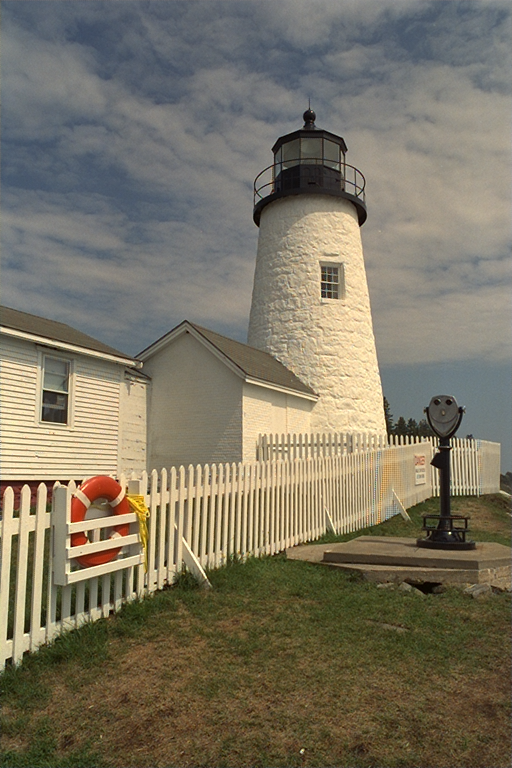

# libdebayer

A CUDA accelerated debayering library with C/C++ and Rust support.

## Dev Setup

```
nix develop
```

This enters a dev shell with all of the necessary build dependencies.

## Library Breakdown

### libdebayer

This is a simple C API that wraps the underlying CUDA kernels. The C
API assumes the images are already in GPU memory. libdebayer
implements 3 debayering algorithms:

- [Menon 2007](https://citeseerx.ist.psu.edu/document?repid=rep1&type=pdf&doi=8c8e4a3cf6d0b8dfdcd36652718ad54afd2fe5fe)
- [Malvar 2004](https://www.microsoft.com/en-us/research/wp-content/uploads/2016/02/Demosaicing_ICASSP04.pdf)
- Bilinear (same as builtin OpenCV)

### libdebayercpp

This provides a higher level C++ API that performs cudaMemcpy's from
host to device. An example of how to use this library is in
`benchmark/cpp`.

### libdebayer-rs

This provides a higher level Rust API with `TryFrom` traits to go from
an OpenCV `Mat` to a debayered `Mat`. An example of how to use this
library is in `rust/examples/test_benchmark.rs`. This test benchmark
is identical to the `benchmark/cpp` program.

### Run Rust Example

```
nix develop
cd rust
KODAK_FOLDER_PATH="<path-to-benchmark-kodak-files>" cargo run --example test_benchmark
```

## Benchmark

libdebayer is benchmarked against OpenCV and NPP (Nvidia Performance
Primitives). To run the benchmark for the Malvar 2004 implementation
run the following: `nix run .#kodak_benchmark_cpp`

### Benchmark Results

- OCV-EA gets Average PSNR: 28.616 dB
- NPP gets Average PSNR: 28.8522 dB
- libdebayer Malvar 2004 CUDA kernel gets Average PSNR: 33.4554 dB (+4.8394 dB)
- libdebayer Menon 2007 CUDA kernel gets Average PSNR: 37.6907 dB (+9.0747 dB)
- Eliminates color fringing

#### Image Results

Example output from OpenCV-EA:


Example output from NPP (Nvidia Performance Primitives):


Example output from our Malvar 2004 CUDA kernel:


Example outputs from our Menon 2007 CUDA kernel:



