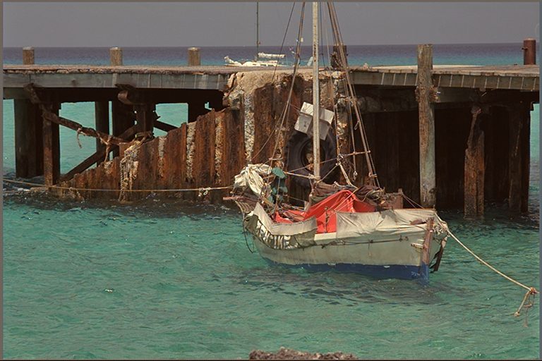

# libdebayer

A CUDA accelerated debayering library with C/C++ and Rust support.

## Dev Setup

```
nix develop
```

This enters a dev shell with all of the necessary build dependencies.

## Library Breakdown

### libdebayer

This is a simple C API that wraps the underlying CUDA kernels. The C
API assumes the images are already in GPU memory. libdebayer
implements 3 debayering algorithms:

- [Malvar 2004](https://www.microsoft.com/en-us/research/wp-content/uploads/2016/02/Demosaicing_ICASSP04.pdf)
- Bilinear (same as builtin OpenCV)
- Saronic custom algorithm (TODO: more details here or delete since Malvar 2004 has the best performance)

### libdebayercpp

This provides a higher level C++ api that performs cudaMemcpy's from
host to device. An example of how to use this library is in
`benchmark/cpp`.

### libdebayer-rs TODO: implement higher level safe rust API with cuda
runtime calls via the cust crate

## Benchmark

libdebayer is benchmarked against OpenCV and NPP (Nvidia Performance
Primitives). To run the benchmark for the Malvar 2004 implementation
run the following: `nix run .#kodak_benchmark_cpp`

### Benchmark Results

- OCV-EA gets Average PSNR: 28.616 dB
- NPP gets Average PSNR: 28.8522 dB
- libdebayer CUDA kernel gets Average PSNR: 33.4554 dB (+4.8394dB)
- Greatly reduces color fringing

#### Image Results

Example output from OpenCV-EA:


Example output from NPP:


Example output from our CUDA kernel:




